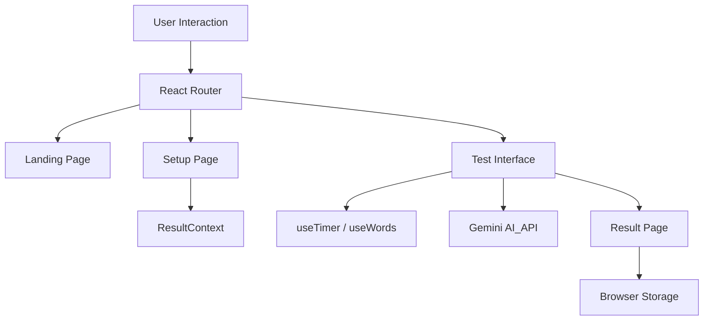

<!-- _class: lead -->
# TypeSprint ⚡
## The Classic Typing Test, Reimagined with AI

**Technical Implementation Review**
React | Vite | Google Gemini | Styled Components

---

# 🎯 Project Objective

To build a modern, high-performance typing speed trainer that solves the problem of repetitive content in traditional typing tests.

**Key Goals:**
1.  **Dynamic Content**: Eliminate static word lists using Generative AI.
2.  **Visual Excellence**: Implement a "Glassmorphic" UI for a premium feel.
3.  **Local Persistence**: Track user progress without requiring a database Login.
4.  **Responsiveness**: Ensure a seamless experience across Mobile and Desktop.

---

# 🏗️ Architecture Overview

The application follows a standard **Single Page Application (SPA)** architecture powered by Vite.



---

# 1. React Components
**Requirement**: "Clean folder structure + reusable components"

We utilized a modular folder structure to separate concerns:
*   `src/components`: Dumb/UI components (e.g., `NavBar`, `Footer`).
*   `src/pages`: Smart/View components connected to the router.

**Example from `src/components/NavBar.jsx`**:
```jsx
const NavBar = () => {
  const { toggleTheme, isDarkMode } = useTheme();
  
  return (
    <Nav>
      <Logo to="/">TypeSprint</Logo>
      <ThemeButton onClick={toggleTheme}>
        {isDarkMode ? '🌙' : '☀️'}
      </ThemeButton>
    </Nav>
  );
};
```

---

# 2. Props & State
**Requirement**: "Props & State Management"

We handle state at multiple levels:
1.  **Local State**: `useState` for form inputs and toggles.
2.  **Prop Drilling**: Passing data to styled components for dynamic CSS.

**Example: Dynamic Styling via Props**:
```jsx
// Setup.jsx
<OptionButton 
    $active={config.difficulty === 'hard'} // Prop passed to CSS
    onClick={() => setDifficulty('hard')}
>
    Hard Mode
</OptionButton>

// Styled Component
const OptionButton = styled.button`
  background: ${props => props.$active ? '#4f46e5' : 'transparent'};
  color: ${props => props.$active ? 'white' : 'black'};
`;
```

---

# 3. Custom Hooks
**Requirement**: "Hooks (useState, useEffect, custom hooks)"

We created custom hooks to encapsulate complex logic and specific behaviors.

**`useTimer` Hook**:
Abstracts the countdown logic, ensuring accurate seconds-based timing.
```javascript
// src/hooks/useTimer.js
const useTimer = (initialTime) => {
    const [timeLeft, setTimeLeft] = useState(initialTime);
    const [isRunning, setIsRunning] = useState(false);

    useEffect(() => {
        let interval;
        if (isRunning && timeLeft > 0) {
            interval = setInterval(() => setTimeLeft(t => t - 1), 1000);
        }
        return () => clearInterval(interval);
    }, [isRunning, timeLeft]);

    return { timeLeft, start: () => setIsRunning(true), ... };
};
```

---

# 4. Data Fetching (AI Integration)
**Requirement**: "JSON data fetching (local or API-based)"

We use a **Hybrid Strategy**:
1.  **Primary**: Fetch dynamic paragraphs from **Google Gemini API**.
2.  **Fallback**: Use local `words.json` if the API fails or is offline.

**Implementation**:
```javascript
// src/utils/gemini.js
export const generateParagraph = async (difficulty) => {
    try {
        const model = genAI.getGenerativeModel({ model: "gemini-1.5-flash" });
        const result = await model.generateContent(`Generate ${difficulty} text...`);
        return result.response.text();
    } catch (error) {
        console.warn("API Fail, utilizing local backup");
        return getRandomLocalParagraph(); // Fallback logic
    }
}
```

---

# 5. Routing & Navigation
**Requirement**: "React Router (Link, Routes, Params)"

We use `react-router-dom` v6 for client-side routing.

**Route Configuration (`App.jsx`)**:
```jsx
<Routes>
    <Route path="/" element={<Home />} />
    <Route path="/setup" element={<Setup />} />
    <Route path="/test" element={<Test />} />
    {/* Wildcard 404 Route */}
    <Route path="*" element={<Navigate to="/" />} />
</Routes>
```
*   **Navigation**: We use the `useNavigate` hook to programmatically redirect users from the *Test* page to the *Results* page upon completion.

---

# 6. Higher-Order Components (HOC)
**Requirement**: "Higher-Order Components (HOC)"

We implemented HOCs for **Security and Validation**:

1.  **`withConfigCheck`**: wraps the Test page.
    *   *Role*: Checks if the user has actually selected a difficulty/time.
    *   *Action*: Redirects to `/setup` if configuration is missing.

2.  **`withProtection`**: wraps the Result page.
    *   *Role*: Prevents users from manually typing `/result` without taking a test.
    *   *Action*: Redirects to `/` if no score data exists in context.

---

# 7. Styled Components
**Requirement**: "Styled-components or CSS modules"

We utilized `styled-components` for a CSS-in-JS approach, enabling **Dynamic Theming**.

**Theming Implementation**:
```javascript
// Global Theme Variables
export const darkTheme = {
    primary: '#6366f1',
    background: '#0f172a',
    text: '#f8fafc',
    card: 'rgba(30, 41, 59, 0.7)' // Glassmorphism base
};

// Usage in Component
const Card = styled.div`
    background: ${({ theme }) => theme.card};
    backdrop-filter: blur(12px); // The "Glass" effect
    border: 1px solid ${({ theme }) => theme.primary};
`;
```

---

# 8. Context API (State Management)
**Requirement**: "Context API"

We use Context to avoid Prop Drilling across the application.

**`ResultContext`**:
*   **What it holds**: 
    1.  Test Configuration (Duration, Difficulty).
    2.  Live Results (WPM, Accuracy, Mistakes).
*   **Why**: The *Setup* page sets the config, the *Test* page uses it, and the *Result* page displays the outcome. These are sibling components that need shared state.

```jsx
// src/context/ResultContext.jsx
export const ResultProvider = ({ children }) => {
    const [config, setConfig] = useState({ duration: 60, mode: 'medium' });
    const [result, setResult] = useState(null);
    
    return (
        <Context.Provider value={{ config, setConfig, result, setResult }}>
            {children}
        </Context.Provider>
    );
};
```

---

# 9. Local Storage (Persistence)
**Feature**: "Leaderboard & History"

To provide value without backend complexity, we persist data to the browser.
*   **Hook**: `useLocalStorage(key, initialValue)`
*   **Usage**: The Leaderboard component reads from `localStorage['leaderboard']`.
*   **Privacy**: Data never leaves the user's device.

---

# 🚀 Future Improvements

While feature-complete, future updates could include:
1.  **Multiplayer Mode**: racing against friends via WebSockets.
2.  **Custom Text Upload**: allowing users to paste their own articles.
3.  **Account System**: utilizing Firebase/Supabase for cross-device history.

---

# Thank You! ⚡
