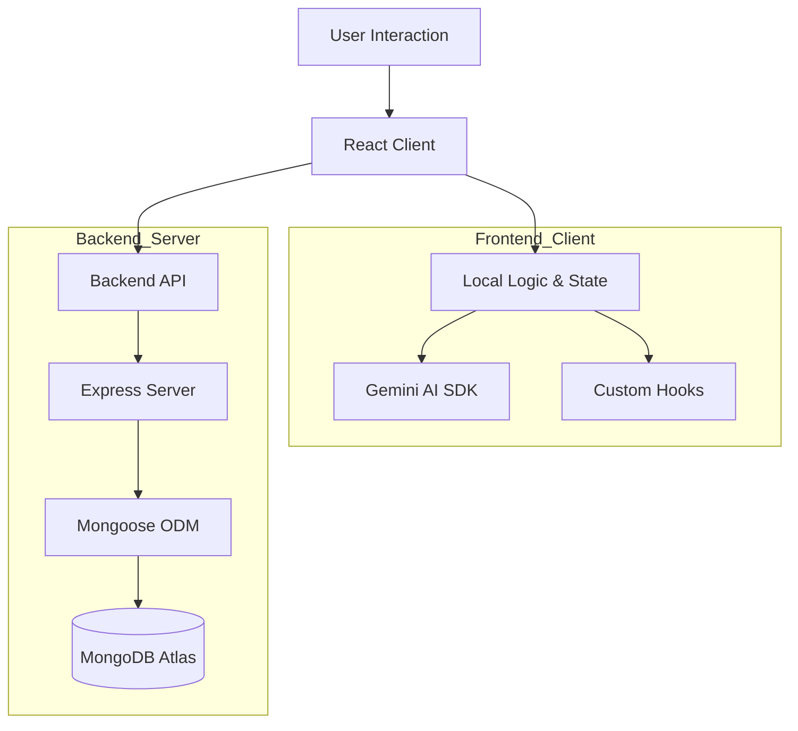

<!-- _class: lead -->
# TypeSprint ⚡
## The Classic Typing Test, Reimagined with AI

MERN Stack (MongoDB, Express, React, Node) | Google Gemini | Styled Components

---

# 🎯 Project Objective

To build a modern, high-performance, **Full-Stack** typing speed trainer that solves the problem of repetitive content and lack of global competition.

**Key Goals:**
1.  **Dynamic Content**: Eliminate static word lists using Generative AI.
2.  **Global Leaderboard**: Persistent high scores using a dedicated Backend API.
3.  **Visual Excellence**: Implement a "Glassmorphic" UI for a premium feel.
4.  **Responsiveness**: Ensure a seamless experience across Mobile and Desktop.

---

# 🏗️ Architecture Overview

The application follows a **Client-Server Architecture** deployed as a Monorepo.




---

# 📂 Key Files & Responsibilities

## Frontend (`client/src`)
*   **`main.jsx`**: Entry point. Mounts the React app to the DOM.
*   **`App.jsx`**: Main layout and Router configuration. Filters traffic to pages.
*   **`pages/Home.jsx`**: Landing page with features and "Get Started" CTA.
*   **`pages/Setup.jsx`**: Configuration dashboard (Time, Difficulty, Name).
*   **`pages/Test.jsx`**: Core game logic. Handles typing, Timer, and AI generation.
*   **`pages/Leaderboard.jsx`**: Displays global rankings with pagination & filters.
*   **`context/ResultContext.jsx`**: Top-level state for sharing game config and results.
*   **`utils/gemini.js`**: Service file for communicating with Google Gemini AI.

## Backend (`server/`)
*   **`index.js`**: Express application entry point. Connects to MongoDB and defines Routes.
*   **`models/Score.js`**: Mongoose Schema defining the structure of a Score entry (name, wpm, difficulty, etc).

## Root & Config
*   **`api/index.js`**: Serverless adapter that bridges Express to Vercel Functions.
*   **`vercel.json`**: Deployment configuration handling routing and rewrites.
*   **`package.json`**: Project dependencies and scripts.

---


# 1. Tech Stack Evolution
**Requirement**: "Full Stack MERN Implementation"

We evolved the project from a simple SPA to a robust Full-Stack application:

*   **MongoDB**: Stores user scores, difficulties, and timestamps.
*   **Express & Node.js**: REST API handling score submissions and leaderboard retrieval.
*   **React**: The dynamic frontend interface.
*   **Node.js**: The runtime environment.

This allows for **Real-time Leaderboards** and **Global Competition** that purely client-side apps cannot offer.

---

# 2. React Components
**Requirement**: "Clean folder structure + reusable components"

We utilized a modular folder structure to separate concerns:
*   `client/src/components`: Dumb/UI components (e.g., `NavBar`, `Footer`).
*   `client/src/pages`: Smart/View components connected to the router.

**Example from `src/components/NavBar.jsx`**:
```jsx
const NavBar = () => {
  const { toggleTheme, isDarkMode } = useTheme();
  
  return (
    <Nav>
      <Logo to="/">TypeSprint</Logo>
      <ThemeButton onClick={toggleTheme}>
        {isDarkMode ? '🌙' : '☀️'}
      </ThemeButton>
    </Nav>
  );
};
```

---

# 3. Props & State
**Requirement**: "Props & State Management"

We handle state at multiple levels:
1.  **Local State**: `useState` for form inputs (Name, Time).
2.  **Global State**: `ResultContext` for sharing User Name and Score data across pages.
3.  **Prop Drilling**: Passing data to styled components for dynamic CSS.

---

# 4. Custom Hooks
**Requirement**: "Hooks (useState, useEffect, custom hooks)"

We created custom hooks to encapsulate complex logic.

**`useTimer` Hook**:
Abstracts the countdown logic, ensuring accurate seconds-based timing.
```javascript
// src/hooks/useTimer.js
const useTimer = (initialTime) => {
    const [timeLeft, setTimeLeft] = useState(initialTime);
    // ... logic for setInterval
    return { timeLeft, start: () => setIsRunning(true), ... };
};
```

---

# 5. Data Fetching (AI & specific Database)
**Requirement**: "JSON data fetching (local or API-based)"

We use a **Dual-Fetching Strategy**:

1.  **AI Content**: Fetches dynamic paragraphs from **Google Gemini API** for the typing test.
2.  **Leaderboard Data**: Fetches JSON data from our custom **Express Backend** (`/api/scores`).

**Backend Integration (`Leaderboard.jsx`)**:
```javascript
useEffect(() => {
    fetch('/api/scores?difficulty=hard')
        .then(res => res.json())
        .then(data => setScores(data));
}, []);
```

---

# 6. Routing & Navigation
**Requirement**: "React Router (Link, Routes, Params)"

We use `react-router-dom` v6 for client-side routing.

**Route Configuration (`App.jsx`)**:
```jsx
<Routes>
    <Route path="/" element={<Home />} />
    <Route path="/setup" element={<Setup />} />
    <Route path="/test" element={<Test />} />
    <Route path="/leaderboard" element={<Leaderboard />} />
</Routes>
```

---

# 7. Backend Implementation
**Requirement**: "Node.js Schema and API"

We implemented a robust backend structure:

**Mongoose Schema (`Score.js`)**:
```javascript
const ScoreSchema = new mongoose.Schema({
    name: String,
    wpm: Number,
    accuracy: Number,
    difficulty: String,
    date: { type: Date, default: Date.now }
});
```

**Express Route (`index.js`)**:
```javascript
app.post('/api/scores', async (req, res) => {
    const newScore = new Score(req.body);
    await newScore.save();
    res.status(201).json(savedScore);
});
```

---

# 8. Deployment (Vercel)
**Requirement**: "Production Ready"

The project is configured for **Serverless Deployment** on Vercel.
*   **Adapter**: `api/index.js` bridges Express to Vercel Functions.
*   **Config**: `vercel.json` handles rewrites for API and Static assets.
*   **Database**: Connected to **MongoDB Atlas** (Cloud).

---


---

# 🚀 Future Scope

While TypeSprint is feature-rich, we have ambitious plans:

1.  **Multiplayer Racing**: Challenge friends in real-time 1v1 lobbies (Socket.io).
2.  **User Authentication**: Save history across devices with secure login (Auth0).
3.  **Advanced Analytics**: Visual heatmaps of your keyboard efficiency.
4.  **Custom Texts**: Upload your own code or articles to practice.

---

# Thank You! ⚡
