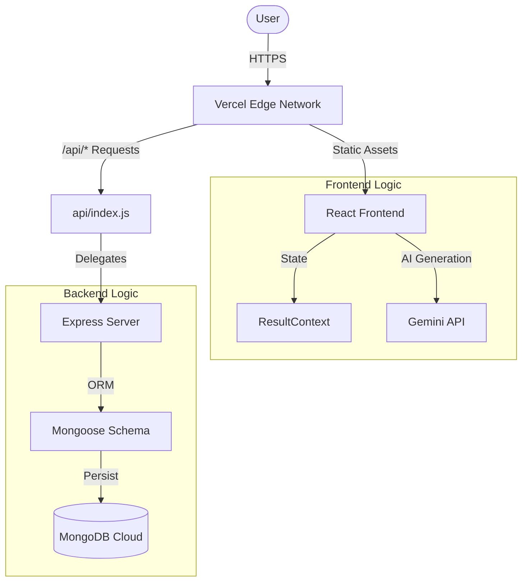

# TypeSprint - Project Technical Report

## 1. Executive Summary
TypeSprint is a modern, full-stack typing speed application designed to test and improve users' typing efficiency. Unlike traditional typing tests using static text, TypeSprint leverages **Generative AI (Google Gemini)** to create dynamic, unique content for every session. The application features a persistent global leaderboard powered by a **MERN Stack** (MongoDB, Express, React, Node.js) architecture and is deployed via **Vercel Serverless Functions**.

---

## 2. System Architecture

The project follows a **Monorepo** structure separating the Client (Frontend) and Server (Backend API), bridging them via Vercel's serverless adapter.



---

## 3. Directory & File Breakdown

### 📂 Root Directory
The entry point for configuration and deployment.

*   **`package.json`**: The root configuration. Crucially, it contains the `build` script (`cd client && npm run build`) which tells Vercel how to compile the frontend, and dependencies (`express`, `mongoose`) needed for the serverless backend.
*   **`vercel.json`**: The deployment map. It defines `rewrites` to route API traffic to the backend and all other traffic to the React Single Page Application (SPA).
*   **`api/index.js`**: A specialized adapter file. It imports the Express app and exports it as a Vercel Serverless Function, allowing the Node.js backend to run without a dedicated VPS.

---

### 📂 Client (`client/src`)
The React Frontend application built with Vite.

#### Core Entry
*   **`main.jsx`**: The bootstrapper. It finds the DOM root and renders the `App` component wrapped in strict mode.
*   **`App.jsx`**: The Layout Engine. It handles the Routing (`react-router-dom`) between Home, Test, and Leaderboard pages, and wraps the app in the `ResultProvider` context.
*   **`index.css`**: Global styles, including the CSS Variables for the "Glassmorphism" theme and dark mode palette.

#### 📁 `client/src/pages` (Views)
*   **`Home.jsx`**: The landing page. Displays the value proposition and allows navigation to setup.
*   **`Setup.jsx`**: The configuration dashboard. Complex state management here handles:
    *   **User Name**: validation.
    *   **Difficulty**: ('easy', 'medium', 'hard') which adjusts time presets.
    *   **Mode**: ('test' vs 'practice').
*   **`Test.jsx`**: The game engine.
    *   **Logic**: Tracks `typed` characters vs `paragraph` characters.
    *   **Timer**: Uses `useTimer` hook for accurate countdowns.
    *   **WPM Algo**: Calculates words per minute `(chars / 5) / time`.
*   **`Result.jsx`**: The summary screen. It displays detailed stats (WPM, Accuracy) and handles the **Async POST request** to save the score to the database.
*   **`Leaderboard.jsx`**: The data visualization page.
    *   **Pagination**: Implements logic to fetch scores in chunks (e.g., `?page=1&limit=5`).
    *   **Filtering**: Allows filtering by difficulty level.

#### 📁 `client/src/utils` (Helpers)
*   **`gemini.js`**: The AI Service Layer.
    *   Initialize `GoogleGenerativeAI` with the API Key.
    *   Generates prompts dynamically based on difficulty (e.g., "Generate a simple paragraph about Space").
    *   **Logic**: Uses a high `temperature` (0.9) to ensuring varied, creative outputs.

#### 📁 `client/src/context`
*   **`ResultContext.jsx`**: The Global State Store. It prevents "prop drilling" by allowing any component (Setup, Test, Result) to access shared data like `userName`, `testConfig`, and `result` (score).

---

### 📂 Server (`server/`)
The Node.js Backend API.

#### Core Logic
*   **`index.js`**: The Express Application.
    *   **Middleware**: Configures CORS (Cross-Origin Resource Sharing) and JSON parsing.
    *   **DB Connection**: Connects to MongoDB Atlas using `mongoose`.
    *   **Routes**:
        *   `POST /api/scores`: Validates input and saves a new score.
        *   `GET /api/scores`: Retrieves sorted, paginated high scores.
*   **`models/Score.js`**: The Database Schema. Defines the "Shape" of our data:
    *   `name`: String (Required)
    *   `wpm`: Number
    *   `accuracy`: Number
    *   `date`: Date (Defaults to `Date.now`)

---

## 4. Key Algorithms & Implementation Details

### 🔄 Pagination Logic (`Leaderboard.jsx` + `server/index.js`)
To avoid overloading the browser with thousands of scores, we implemented Server-Side Pagination.
**Backend**:
```javascript
// Calculate how many docs to skip based on page number
const skip = (page - 1) * limit;
const scores = await Score.find().skip(skip).limit(limit);
```
**Frontend**:
Maintains a `page` state. "Next" button increments page, triggering a `useEffect` re-fetch.

### 🤖 AI Content Generation (`gemini.js`)
We use a **Dynamic Prompting Strategy**. instead of asking for "a paragraph", we first pick a random topic from an array (`['space', 'ocean', 'tech'...]`) and inject it into the prompt.
> "Generate a [difficulty] paragraph about [randomTopic]..."
This ensures the user never types the same text twice.

### 🛡️ Deployment Strategy (Vercel)
The project uses valid "Hybrid" deployment:
1.  **Frontend**: Built into static HTML/JS/CSS assets (via `vite build`).
2.  **Backend**: Converted into AWS Lambda-like serverless functions (via `vercel-node`).
The `vercel.json` file orchestrates this so they live on the same domain, preventing CORS issues.

---

## 5. Future Scope
1.  **Multiplayer**: Real-time racing using WebSockets.
2.  **Authentication**: Save user history securely.
3.  **Voice Mode**: Dictation practice for accessibility.

---
**Report Generated**: 2026-01-25
**Author**: TypeSprint Team (Assisted by Google DeepMind Agent)
